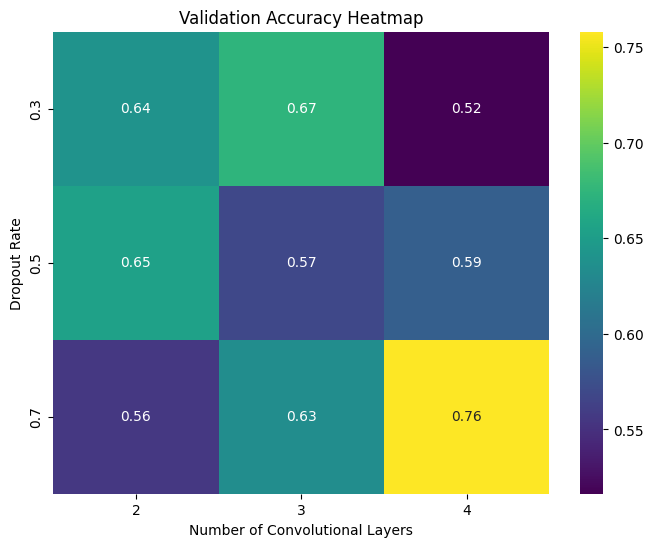

# Hypertuning Experiment Report

## Experiment Setup
- Dataset: Hymenoptera (ants vs. bees)  
- Model: A configurable Convolutional Neural Network (CNN) with adjustable hyperparameters:
  - Dropout Rates: 0.3, 0.5, 0.7  
  - Number of Convolutional Layers: 2, 3, 4  
- Training: Each configuration was trained for 5 epochs using a fixed training and validation split.

## Hyperparameter Exploration
The grid search was performed over two hyperparameters:
- Dropout Rate: Controls the regularization strength by randomly dropping units during training.
- Number of Convolutional Layers: Impacts the model’s capacity to learn spatial hierarchies.

### Validation Accuracy Results

| Dropout Rate | Num Conv Layers | Validation Accuracy |
|--------------|-----------------|---------------------|
| 0.3          | 2               | 68.63%              |
| 0.3          | 3               | 64.05%              |
| 0.3          | 4               | 71.24%              |
| 0.5          | 2               | 66.01%              |
| 0.5          | 3               | 69.11%              |
| 0.5          | 4               | 56.21%              |
| 0.7          | 2               | 64.71%              |
| 0.7          | 3               | 64.05%              |
| 0.7          | 4               | 56.86%              |

## Visualization
The heatmap illustrates how the dropout rate and the number of convolutional layers interact to influence the validation accuracy:

Figure 1: Heatmap of Validation Accuracy for different Hyperparameter Combinations.

## Reflection
- The best performance was observed with a dropout rate of 0.3 and 4 convolutional layers, suggesting that this combination provides a good balance between model complexity and regularization.
- A higher number of layers increases the model's capacity, which can be beneficial when paired with a lower dropout rate.
- Some configurations with higher dropout (0.5 and 0.7) underperformed, indicating that too much regularization might be hindering learning in this context.
- Further experiments, such as increasing the number of epochs or exploring additional hyperparameters like learning rate and fully connected layer size, could provide deeper insights.

## Conclusion
This hypertuning experiment highlights the importance of balancing model capacity and regularization. The interaction between dropout rate and model depth plays a significant role in the model's ability to generalize. Future work could extend these findings by refining the search space or incorporating additional hyperparameters.
